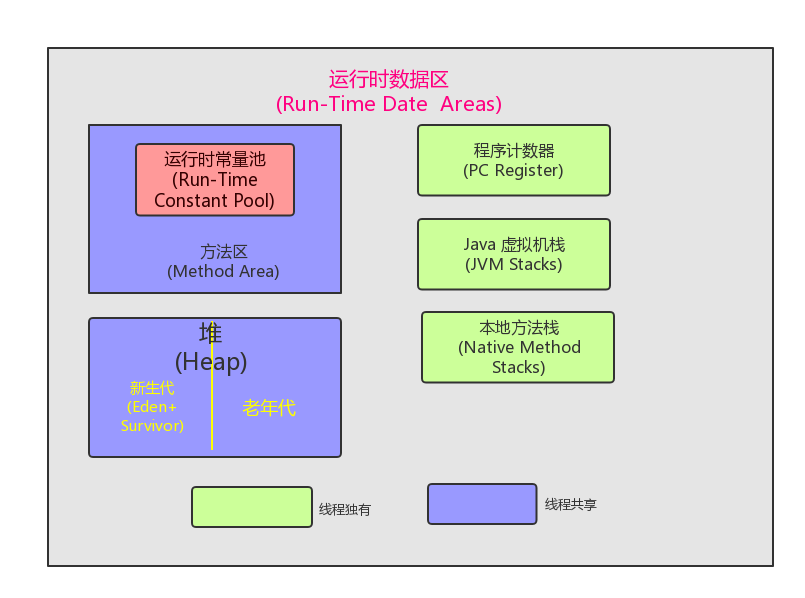

# didi java intern interview
主要问了 JAVA 的基础 ，Spring AOP  IOC ,Spring 框架的源码和 MySQL 的事务以及事务隔离级别。在此做个记录防止遗忘。

### 1. String,StringBuffer 和 StringBuilder 区别
* a) String 是不可变的`对象`，他一旦被创建就不能改变。已经创建的String 对象保存在`静态String池(Constant String Pool)`当中,JAVA 中每一个不可变的对象都是线程安全的，String 不能同时应用于两个线程。
* b)StringBuffer  是可以改变对象值的所以他是可变的，通过 StringBuffer 创建对象后存储在堆，StringBuffer 和 StringBuilder 有同样的方法但是 StringBuffer 中的每一个方法都是 synchronized 所以 StringBuffer 是线程安全的。由于 synchronized 锁的机制每个方法一次只能被一个线程访问。但是线程安全也有缺点，这就影响了 StringBuffer 的性能，所以当调用同一个方法是 StringBuilder 要快与 StringBuffer
* c)StringBuilder 跟StringBuffer 类似，他也将对象存储在堆并且可以被修改，最大的区别就是 StrinbBuilder 不是线程安全的。

### 2. JVM 的内存模型

* 内存结构
  
* a) **程序计数器**（PC, Program Counter Register) : 在 JVM 中每个线程都有自己的 PC,在任何时间点每个线程都只有一个方法执行也就是所谓的当前方法，如果这个方法不是本地方法，程序计数器会存储当前线程正在执行的 JAVA 方法的 JVM 指令地址，否则 PC 为未定义值
* b)**JAVA 虚拟机栈**（JVM Stack）：每个线程有一个私有的 JVM 栈，跟线程同时创建，用来存储一个个栈桢（Stack frame). JVM 对栈的操作只有对栈桢的 pop 和 push, JVM 栈的大小可以是固定的也可以设置成随计算需求动态扩充或收缩。
> 如果是栈大小是固定大小的那么当线程所需要的栈空间大小大于允许的栈空间大小时候则抛出 `StackOverflowError`，如果栈空间是动态扩展的那么当内存不能满足扩展的需要的时候或者不足以初始化一个线程的栈的时候就会抛出 `OutOfMemoryError`

* c)**堆**(Heap): 堆被所有的线程共享。堆是运行时数据区域，几乎所有类的实例和数组都被分配到堆上，当虚拟机创建的时候堆随即被创建,对象的堆存储由自动存储管理系统回收,比较有名的就是 GC(garbage collector),当自动存储管理系统不能提供马权奇女足要求的堆空间的时候 会抛出 `OutOfMemoryError`。堆内存不需要是连续的。
* d)**方法区**（Method Area):方法区也是线程共享的内存区域， 用于存储每个类的结构信息，以及对应的运行时常量池，字段和方法数据，方法和构造器代码。运行时常量池主要存储各种常量信息，主要有编译期生成的字面量和运行时决定的符合引用。
* e)**本地方法栈**(Native Method Stacks)：用于支持本地方法调用（不是用 Java 语言写的方法），也被用于其他语言的jvm 指令集解释器的实现
* f)**栈桢**(Frames): 栈桢用来存储数据和部分结果，以及执行动态链接，返回方法值和分派异常。当每一个方法调用的时候相对应的栈桢就会被创建成为新的当前桢，当方法调用完成时栈桢也随之被销毁，而不管方法是正常完成还是抛出异常。每个栈桢有自己一系列的局部变量，操作数栈(operand stack，用于存储常量以及值的操作，涉及到一些 JVM 指令例如iadd)，和对当前线程对象的运行时常量池的引用。每一时刻只有一个活动的栈桢，称作当前桢，对应方法叫做当前方法，定义当前方法的类叫做当前类或当前对象。

### 3. GC 机制

