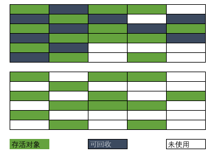

# didi java intern interview
主要问了 JAVA 的基础 ，Spring AOP  IOC ,Spring 框架的源码和 MySQL 的事务以及事务隔离级别。在此做个记录防止遗忘。

### 1. String,StringBuffer 和 StringBuilder 区别
* a) String 是不可变的`对象`，他一旦被创建就不能改变。已经创建的String 对象保存在`静态String池(Constant String Pool)`当中,JAVA 中每一个不可变的对象都是线程安全的，String 不能同时应用于两个线程。
* b)StringBuffer  是可以改变对象值的所以他是可变的，通过 StringBuffer 创建对象后存储在堆，StringBuffer 和 StringBuilder 有同样的方法但是 StringBuffer 中的每一个方法都是 synchronized 所以 StringBuffer 是线程安全的。由于 synchronized 锁的机制每个方法一次只能被一个线程访问。但是线程安全也有缺点，这就影响了 StringBuffer 的性能，所以当调用同一个方法是 StringBuilder 要快与 StringBuffer
* c)StringBuilder 跟StringBuffer 类似，他也将对象存储在堆并且可以被修改，最大的区别就是 StrinbBuilder 不是线程安全的。

### 2. JVM 的内存模型

* 内存结构
  
* a) **程序计数器**（PC, Program Counter Register) : 在 JVM 中每个线程都有自己的 PC,在任何时间点每个线程都只有一个方法执行也就是所谓的当前方法，如果这个方法不是本地方法，程序计数器会存储当前线程正在执行的 JAVA 方法的 JVM 指令地址，否则 PC 为未定义值
* b)**JAVA 虚拟机栈**（JVM Stack）：每个线程有一个私有的 JVM 栈，跟线程同时创建，用来存储一个个栈桢（Stack frame). JVM 对栈的操作只有对栈桢的 pop 和 push, JVM 栈的大小可以是固定的也可以设置成随计算需求动态扩充或收缩。
> 如果是栈大小是固定大小的那么当线程所需要的栈空间大小大于允许的栈空间大小时候则抛出 `StackOverflowError`，如果栈空间是动态扩展的那么当内存不能满足扩展的需要的时候或者不足以初始化一个线程的栈的时候就会抛出 `OutOfMemoryError`

* c)**堆**(Heap): 堆被所有的线程共享。堆是运行时数据区域，几乎所有类的实例和数组都被分配到堆上，当虚拟机创建的时候堆随即被创建,对象的堆存储由自动存储管理系统回收,比较有名的就是 GC(garbage collector),当自动存储管理系统不能提供马权奇女足要求的堆空间的时候 会抛出 `OutOfMemoryError`。堆内存不需要是连续的。
* d)**方法区**（Method Area):方法区也是线程共享的内存区域， 用于存储每个类的结构信息，以及对应的运行时常量池，字段和方法数据，方法和构造器代码。运行时常量池主要存储各种常量信息，主要有编译期生成的字面量和运行时决定的符合引用。
* e)**本地方法栈**(Native Method Stacks)：用于支持本地方法调用（不是用 Java 语言写的方法），也被用于其他语言的jvm 指令集解释器的实现
* f)**栈桢**(Frames): 栈桢用来存储数据和部分结果，以及执行动态链接，返回方法值和分派异常。当每一个方法调用的时候相对应的栈桢就会被创建成为新的当前桢，当方法调用完成时栈桢也随之被销毁，而不管方法是正常完成还是抛出异常。每个栈桢有自己一系列的局部变量，操作数栈(operand stack，用于存储常量以及值的操作，也称作求值栈，涉及到一些 JVM 指令例如iadd)，和对当前线程对象的运行时常量池的引用。每一时刻只有一个活动的栈桢，称作当前桢，对应方法叫做当前方法，定义当前方法的类叫做当前类或当前对象。

### 3. GC 机制
GC 发生时候需要明确的三个问题：
> 摘自 《深入理解 Java 虚拟机》
* 哪些内存需要回收？
* 什么时候回收？
* 如何回收？

在理解如何进行 GC 之前需要了解的是内存如何分配，因为内存回收时候涉及到分代的概念。上节图示中堆分为新生代和老年代。而新生代又分为 Eden，Survivor 如下图：

> ps: 新生代中 Eden 和 Survivior 的比例可以通过 JVM 参数 -XX:SurvivorRation=y  设置 代表 y:1

1. 大多数情况下，对象在新生代的 Eden 区分配当 Eden 区没有足够的空间进行分配的时候发生一次MinorGC,MinorGC 很频繁，发生新生代相对地还有  MajorGC/FullGC 发生在老年代，发生 MajorGC 经常会伴随至少一次 MinorGC （非绝对看收集器）关于Major GC和 Full GC 参考 R大回复(https://www.zhihu.com/question/41922036/answer/93079526)
2. 大对象直接进入老年代，就是那些需要大量连续内存空间的对象例如很长的字符串和数组。
3. 长期存活的对象将进入老年代，HotSpot 采用分代的思想管理内存，虚拟机为每个对象定义了一个 年龄(Age)计数器，当对象在 Eden 出生并经过一次 MinorGC后 仍然存活并且被 Survivor 容纳的话将被移到 Survivor空间中并且对象年龄设置为 1。对象在 Survivor中度过一次 Minor GC 年龄就增加 1，当年龄达到 阀值(默认 15)时候就进入老年代中。虚拟机并不是严格按照这个值进行判断的，这就涉及到动态对象年龄判断， 当 Survivor 中相同年龄所以对象大小总和大于 Survivor 空间一半的时候 年龄大于等于该年龄的对象就直接进入老年代。

#### 3.1哪些内存需要回收？
不可能被任何途径使用的对象需要进行回收,采用`可达性分析算法`（**当前主流的虚拟机实现中没有采用引用计数算法来管理内存的，面试时候需要注意**）可达性分析算法通过一系列的 GC Roots 对象作为起点向下搜索，搜索走过的路径成为引用链，当一个对象到 GC Roots 不可达时候则证明此对象是不可用的。（注意对象死亡的二次标记）
谁可以作为 GC Roots ?  1. 虚拟机栈（栈桢中本地变量表）中引用的对象 2. 方法区中静态属性引用的对象
#### 3.2 什么时候回收？
  当 JVM 判断内存空间不够用的时候，即实则为 Minor GC Full GC触发条件
#### 3.3 如何回收?
1. 标记-清除算法
  分为标记和清除两个阶段，标记出需要回收的对象，在标记完后统一回收标记对象
  * 缺点：标记，清除效率低，会产生大量不连续的空间碎片导致分配较大对象的时候无法找到连续的内存而触发 GC
  
  由上图可以看出在采用 Mark-Sweep 算法后出现了大量的碎片区域。

2. 复制算法

   该算法将内存分为两块，

3. 

